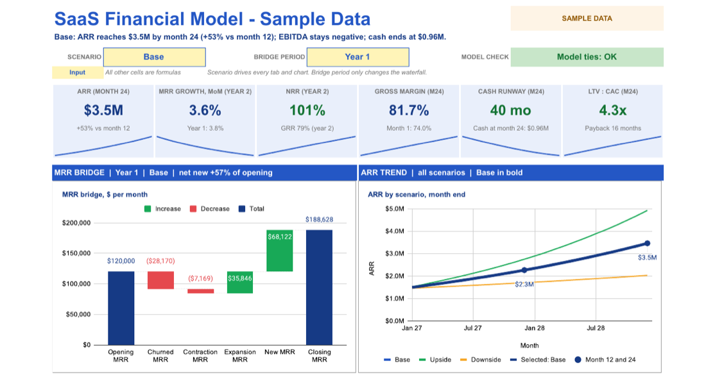
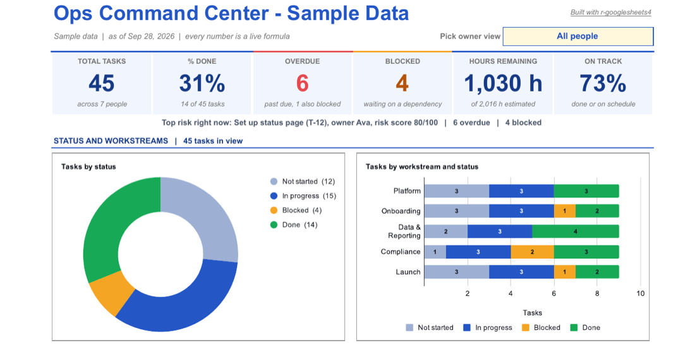
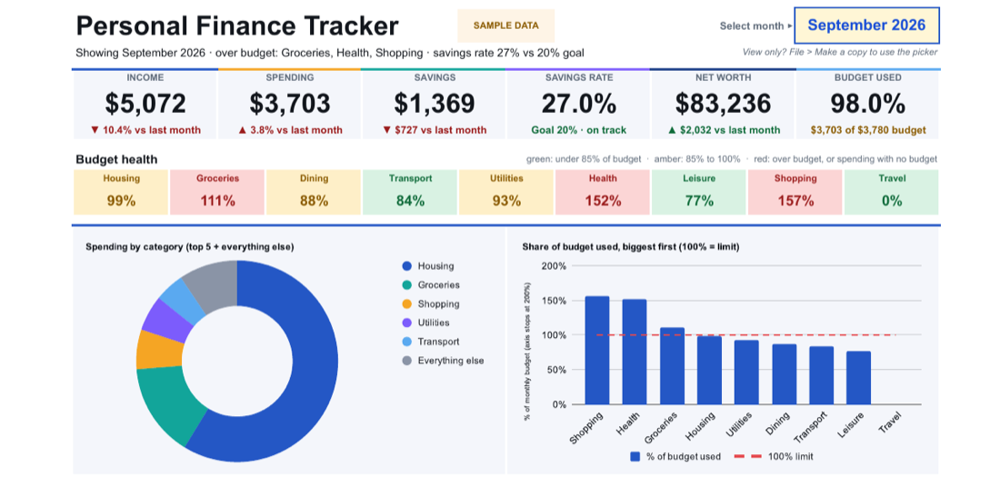

# r-googlesheets4

**Build, format and visually QA Google Sheets from R, driven by your AI coding agent.**

[](https://github.com/salvadoraveldano/r-googlesheets4/actions/workflows/validate.yml)
[](LICENSE)
· [Site](https://salvadoraveldano.github.io/r-googlesheets4/) · [Showcases](examples/showcases/README.md) · [Changelog](CHANGELOG.md)

Ask your coding agent for a styled multi-tab P&L, a KPI dashboard or a budget model.
It writes R with [googlesheets4](https://googlesheets4.tidyverse.org) and formats the
sheet through the Sheets API. Then it exports the sheet to PDF and looks at the pages for
truncated text, `###` numbers, too-narrow columns and misaligned cells. It fixes
what it finds and checks again.

> Unofficial community skill. Posit, the tidyverse team and Google have not endorsed
> it and are not affiliated with it. It builds on their open-source work; see
> [Credits](#credits).

## Install

Claude Code (plugin marketplace):

```
/plugin marketplace add salvadoraveldano/r-googlesheets4
/plugin install r-googlesheets4@r-googlesheets4-marketplace
```

Other agents (Codex, Cursor, and more) via the [skills CLI](https://github.com/vercel-labs/skills):

```
npx skills add salvadoraveldano/r-googlesheets4
```

Or copy `skills/r-googlesheets4/` into your agent's skills folder.

## What you need

- **R**. The skill never installs it for you. No R? See [no-r-alternatives](skills/r-googlesheets4/references/no-r-alternatives.md).
- **A Unix shell.** Built and tested on macOS. CI runs the syntax and offline checks on Linux. Windows through Git Bash or WSL is untested: the setup script looks for R under `Program Files`, but nobody has run it there yet.
- The CRAN packages googlesheets4, googledrive and gargle. The skill asks before installing them.
- A Google account. The first sign-in is one click and needs no Google Cloud project.

> **Using it a lot, or with a team?** The one-click sign-in uses an OAuth client that
> every googlesheets4 user shares, quota included. If you rebuild sheets often or run
> this for a team, register your own OAuth client, or a service account for unattended
> runs. It takes a few minutes and keeps the shared client's quota free for everyone else.
> Steps: [auth.md](skills/r-googlesheets4/references/auth.md).

- For page images in the visual review: `pdftoppm` (poppler) or the R `pdftools` package.
  Without them the skill still audits the layout and hands the PDF to the agent.

## Try it

> "Create a Google Sheet with a monthly P&L for three departments, brand-blue section
> headers, a chart, and conditional formatting for negative variance. Then check how it looks."

> "Refresh the Forecast tab from this CSV every morning with Rscript and cron."

> "My sheet has cut-off labels in column C and the numbers look misaligned. Review it and fix it."

## What makes it different

| | |
|---|---|
| **Visual QA loop** | `visual_qa()` runs a layout audit, exports a PDF, renders page images and applies a scoring rubric. It finds problems that reading cell values back cannot. |
| **Least-privilege auth** | Defaults to the `spreadsheets` scope. Drive access (sharing, finding sheets by name) is opt-in and the agent asks first. |
| **Zero-setup sign-in** | Uses gargle's shared OAuth client: one click, no Cloud project. For heavy, team or unattended use, bring your own client or a service account (see above). |
| **Cell-level formatting** | Wrappers for fonts, fills, borders, merges, freezes, charts, banding, pivots, slicers and protection, which googlesheets4 alone does not cover. |
| **Safe by design** | Never installs R, asks before installing packages, and treats sheet contents as data, not instructions. See [SECURITY.md](SECURITY.md). |

## Showcases

Three sample sheets, each built by one script in [examples/showcases](examples/showcases/README.md) from synthetic data. Run a script and you get your own copy. Visitors with the link can look but not edit, and the dropdowns and pickers do not work for view-only visitors, so use **Make your own copy** to try them.

**SaaS financial model.** Eight tabs and a 24-month forecast. One scenario dropdown drives every tab, and 17 integrity checks feed a status badge.

[Open the sample sheet](https://docs.google.com/spreadsheets/d/1N5A_YHreexPraNFuU7XaKrnTCCQXvsmYY7HZHUpMNlQ/edit?usp=sharing) (view-only) · [Make your own copy](https://docs.google.com/spreadsheets/d/1N5A_YHreexPraNFuU7XaKrnTCCQXvsmYY7HZHUpMNlQ/copy)



**Ops command center.** KPI cards, status and workstream charts, a Gantt drawn by conditional formatting, and a workload heatmap.

[Open the sample sheet](https://docs.google.com/spreadsheets/d/15d2XnvqlwJ4HqnrRCHAgfmw4N5eZq7-CuSFQO6MP73M/edit?usp=sharing) (view-only) · [Make your own copy](https://docs.google.com/spreadsheets/d/15d2XnvqlwJ4HqnrRCHAgfmw4N5eZq7-CuSFQO6MP73M/copy)



**Personal finance tracker.** A month picker drives the dashboard, a budget-health strip and four charts.

[Open the sample sheet](https://docs.google.com/spreadsheets/d/1dPKbynmhf3x_9pFuIMvOOBnjIMmAf4Nw9ot3fFmDVs4/edit?usp=sharing) (view-only) · [Make your own copy](https://docs.google.com/spreadsheets/d/1dPKbynmhf3x_9pFuIMvOOBnjIMmAf4Nw9ot3fFmDVs4/copy)



## Build once, run without a model

The agent builds the sheet by writing an R script. If you keep that script, your team
can rebuild or refresh the sheet with `Rscript`, by hand or on a schedule, with no model
and no tokens. Use the model to design and change the sheet, not to run it every day.

Kelsey Hightower makes the same argument in his PlatformCon 2026 talk
[ZTA: Zero Token Architecture](https://www.youtube.com/watch?v=A7WFt2JQ5sg):
"Infer once, export, and run without inference." A script in version control is also
reproducible and easy to review, and a team that understands it can maintain it without
a model. Changing the design still means editing the script. Details:
[build-once-run-forever.md](skills/r-googlesheets4/references/build-once-run-forever.md).

## Why R (and when not)

googlesheets4 and gargle are the shortest path from a data frame to a styled sheet, and
sign-in needs no Google Cloud setup. If you won't install R, use Python (gspread) or a
Sheets MCP server instead. If quota, team use or unattended runs matter, use your own
OAuth client or a service account. Details in
[auth.md](skills/r-googlesheets4/references/auth.md).

## Layout

```
skills/r-googlesheets4/   SKILL.md, scripts/, references/, templates/, examples/, evals/
examples/showcases/       three sample sheets and the scripts that build them
scripts/                  repo checks: check.sh, offline-test.R, selftest.R (not part of the skill)
docs/                     the one-page site and its screenshots
.claude-plugin/           plugin and marketplace manifests
```

## Getting help

Report problems with this skill (the agent's behavior, the helpers, the setup script,
the docs) in [this repository's issues](https://github.com/salvadoraveldano/r-googlesheets4/issues).
For security problems, follow [SECURITY.md](SECURITY.md) instead of opening a public issue.

Please do **not** report skill problems to the googlesheets4, googledrive or gargle
maintainers. This skill is unofficial and they have not reviewed it. First reproduce the
problem in plain R, with no agent and no skill. If it still fails, it is a package bug,
so follow that package's own reporting guidelines.

## Credits

This skill exists because of the R open-source community. Thank you to
**Jennifer Bryan** and **Posit Software, PBC** for googlesheets4, googledrive and
gargle (with **Lucy D'Agostino McGowan** on googledrive, and **Craig Citro** and
**Hadley Wickham** on gargle), and to everyone in
the tidyverse and r-lib projects, including [rig](https://github.com/r-lib/rig).
The "build once, run without a model" idea comes from Kelsey Hightower's talk, linked
above.
Full notices: [THIRD_PARTY_NOTICES.md](THIRD_PARTY_NOTICES.md).

## License

[MIT](LICENSE). Contributions welcome: [CONTRIBUTING.md](CONTRIBUTING.md).
